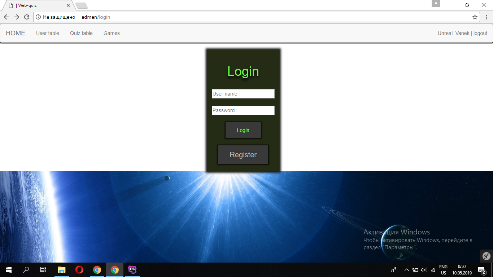
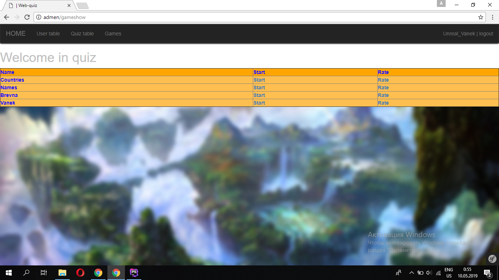

# 1. Оценка ПО по атрибутам

## 1.1. Распознаваемость соответствия

Для пользователя не составит проблему определить необходимость приложения. Также было выбрано соответствующее название, которая описывает, что в приложении будет происходить.

## 1.2. Обучаемость

Интерфейс приложения интуитивно понятный. Функционал системы небольшой, поэтому пользователю просто разобраться в предоставляемых возможностях.

## 1.3. Используемость (операбельность)

В приложении присутствуют все необходимые функции для реализации цели приложения. 

## 1.4. Защита от ошибок пользователя

В приложении нет таких мест, где пользователь мог бы совершить ошибку, повлекшую за собой неисправность
и/или некорректность работы приложения.

## 1.5. Эстетика GUI

На данный момент приложение нуждается в доработке графического интерфейса. Необходимо сделать главную страницу 
где будет находиться информация про само приложение.

## 1.6. Доступность

В системе не предусмотрены специальные возможности для пользователей с нарушением зрения, также приложение не поддерживает голосовой интерфейс.

# 2. Пути улучшения UX

## 2.1. Привести все элементы приложения к единому дизайну.
## 2.2. Сделать графический интерфейс более приятным для глаз пользователя.

# 3. Сравнение "До/После"

Домашняя страница.

До

После

Форма логина

До

После

Список викторин

До

После

