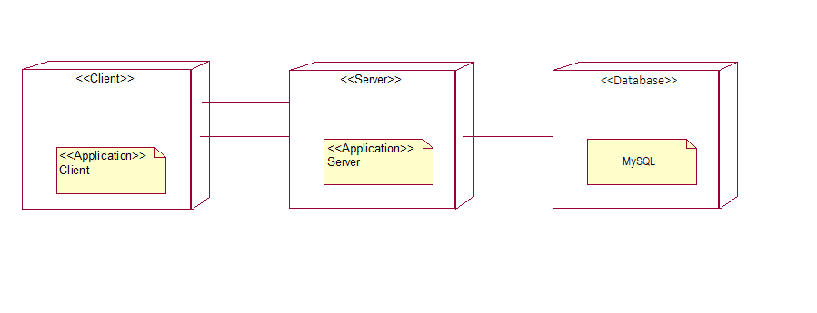
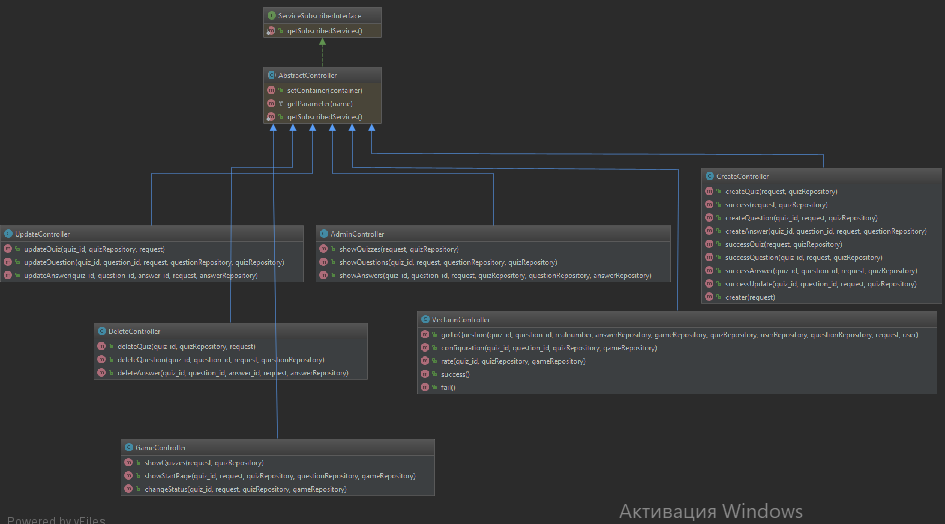

# "To be" архитектура:
# Часть 1
## 1. Тип приложения
Веб-приложения для выполнения преимущественно на сервере в сценариях с постоянным подключением.
## 2.Стратегия развертывания
Клиент/Сервер
## 3. Технологии
* PhP-универсальный язык программирования, который легко встраивается в HTML и синтаксис которого очень прост в изучении.
* MySQL - популярная система для управления базами данных.
* PhPStorm - самая лучшая среда программирования на PhP.
* Symfony - гибкий full-stack Framework, который идеально подходит для относительно больших проектов. 
* JavaScript - язык сценариев, который встраивается в html код.
## 4. Параметры качества
* Простота добавления новой функциональности(удобство и простота обслуживания)
* Легко составить критерии проверки и протестировать приложение в ходе использования(тестируемость)
## 5. Сквозная функциональность
* Кэширование: сохранять данные об игроках в общем хранилище, реализованом с помощью MySQL
* Аутентификация и авторизация
## 6. Диаграмма развёртывания

# "As is" архитектура
# Часть 2

## 1. Диаграмма развёртывания

## 2. Диаграмма классов

# Часть 3
Архитектуры As is и To be в данном случае не отличаются. Приложение строилось по принципу не повторяйтесь и разделение функций.
Пути оптимизации приложения:
Добавить классы-сервисы для выполнения логики приложения.
